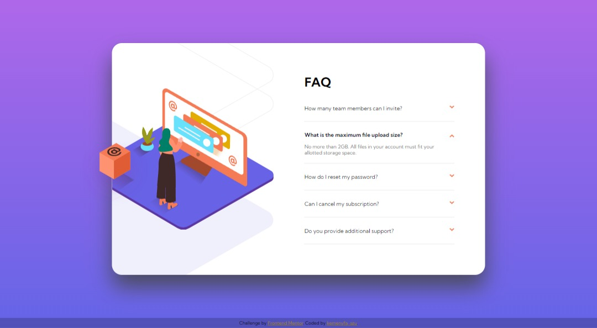
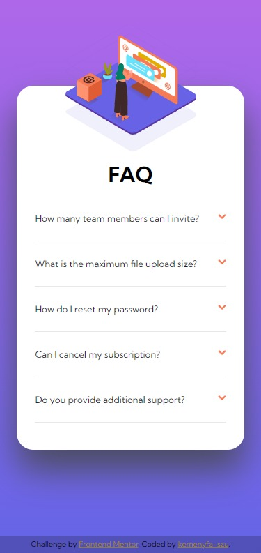

# Frontend Mentor - FAQ accordion card solution

This is a solution to the [FAQ accordion card challenge on Frontend Mentor](https://www.frontendmentor.io/challenges/faq-accordion-card-XlyjD0Oam). Frontend Mentor challenges help you improve your coding skills by building realistic projects.

## Table of contents

- [Overview](#overview)
  - [The challenge](#the-challenge)
  - [Screenshot](#screenshot)
  - [Links](#links)
- [My process](#my-process)
  - [Built with](#built-with)
  - [What I learned](#what-i-learned)
  - [Useful resources](#useful-resources)
- [Author](#author)

**Note: Delete this note and update the table of contents based on what sections you keep.**

## Overview

### The challenge

Users should be able to:

- View the optimal layout for the component depending on their device's screen size
- See hover states for all interactive elements on the page
- Hide/Show the answer to a question when the question is clicked

### Screenshot

Screenshots taken with [FireShot](https://getfireshot.com/)

### Links

- Solution URL: [Add solution URL here](https://your-solution-url.com)
- Live Site URL: [Add live site URL here](https://your-live-site-url.com)

## My process

### Built with

- Semantic HTML5 markup
- CSS custom properties
- Flexbox
- Mobile-first workflow

### What I learned

- How to break the normal flow of elements with _position_ and CSS property and its values.
- Working with details and summary HTML elements
- Transforming pictures with css
- Got familiar with viewport units (vw, vh)

### Useful resources

- [MDN web docs](https://developer.mozilla.org/en-US/docs/Web/CSS/) - I always look it up for possible property values and their visualization.

## Author

- Website - [kemenyfa-szu](https://kemenyfa-szu.github.io/)
- Frontend Mentor - [@kemenyfa-szu](https://www.frontendmentor.io/profile/kemenyfa-szu)
